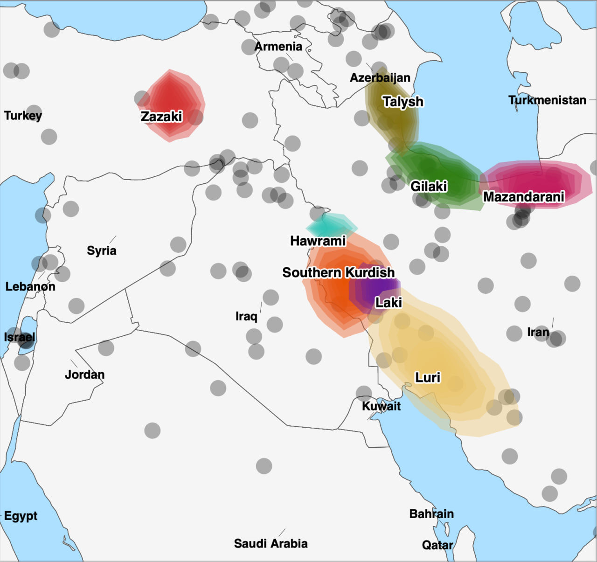
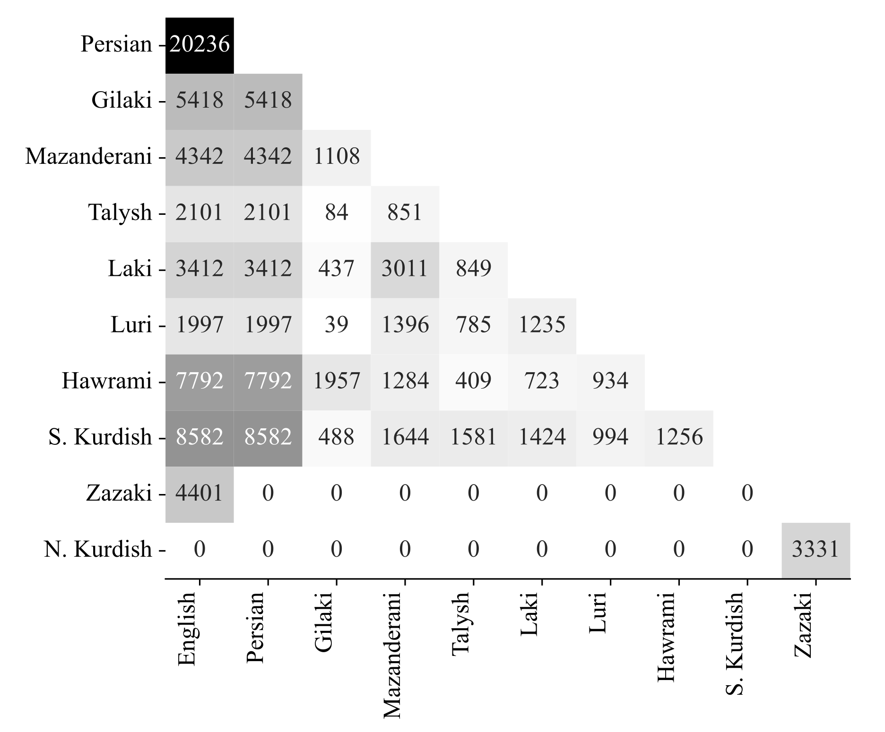

# Parallel Corpora for Low-resourced Middle Eastern Languages

**TL;DR We provide parallel corpora for eight under-represented languages in the Middle East along with scripts to fine-tune NLLB. The resources are open-source. Please consider these languages in your projects!**

<p align="center" width="100%">
    
</p>

The Middle East is characterized by remarkable linguistic diversity, with over 500 million inhabitants speaking more than 60 languages across multiple language families. In a first attempt of its kind, we create parallel corpora for the following eight under-represented languages of the Middle East:

- **Luri Bakhtiari** (`bqi_Arab`)
- **Gilaki** (`glk_Arab`)
- **Hawrami** (`hac_Arab`)
- **Laki** (`lki_Arab`)
- **Mazanderani** (`mzn_Arab`)
- **Southern Kurdish** (`sdh_Arab`)
- **Talysh** (`tly_Arab`)
- **Zazaki** (`zza_Arab`)

This repository provides documentation on our project that aims to develop machine translation for low-resource languages in the Middle East. The fine-tuned model is available on HuggingFace at [https://huggingface.co/SinaAhmadi/NLLB-DOLMA](https://huggingface.co/SinaAhmadi/NLLB-DOLMA).

**The project couldn't be possible without the enthusiasm and passion of over 50 volunteers who contributed to the project by translating over 36,000 sentences in a period of a few months. You are free to use everything, but please be mindful to acknowledge the project if you use it. [Read the license](#license).**

## Parallel Corpora

All the parallel corpora are provided in the [corpora](corpora) folder. These are TSV files containing parallel sentences in three languages: English-Farsi-X. For Zazaki, exceptionally, the test set only contains English-Zazaki pairs and the remaining data is English-Kurmanji-Zazaii. These files are the most comprehensive ones with the following meta-data:

- `en_sentence`: sentence in English
- `fa_sentence`: sentence in Farsi
- `kmr_sentence`: sentence in Farsi
- `translation`: only for Zazaki, sentence in Kurmanji (Northern Kurdish)
- `variety`: variety (dialect)
- `county`: approximate region where the translator comes from
- `orthography`: orthography
- `translator`: translator ID (for internal tracking)

When processing these files, you can extract the relevant columns as all the fields in the metadata are not useful for MT.

### Cross-lingual Alignment

Some of the translated sentences are aligned with the same source sentences in English or Farsi, creating a multilingual parallel corpus ideal for cross-lingual studies. We have merged all sentences across languages based on the English and Farsi source sentences. This multilingual corpus is available at [corpora/common_sentences.tsv](corpora/multilingual-corpus.tsv). To find the meta-data, you should look up the sentences in the original corpora.

The number of parallel sentences across languages are provided in the following coverage matrix. For instance, Laki has 437 and 849 sentences aligned with Gilaki and Talysh, respectively.

<p align="center" width="100%">
    
</p>

## Data Splits

If you are looking for dataset splits, check out the [datasets](datasets) folder where sentences in the [parallel corpora](corpora) are split into test, validation and train sets. To create these splits, we follow a set of rules, explained in detail in the paper. As such, we highly recommend using these splits as a normal 10/20/70 split proportion won't probably represent the dialects and orthographies fairly.

### JSONL

All the dataset splits are also available in `jsonlines` format, ready for training/fine-tuning using [Hugging Face](https://huggingface.co/docs/datasets/v3.2.0/loading#json-files). These files are provided in the [fine-tune](fine-tune) folder. The `base` and `augmented` sub-folders refer to the data setups reported in the paper. Within each folder, you can find the prefixed sentences as well.

The datasets used in the ablation studies are provided in [ablation](fine-tune/ablation) and [samples](fine-tune/samples) folders.

## Summary of Resources

To summarize, these are the available corpora and datasets per language:

| Language | Parallel languages | # Sentence pairs  | # Varieties | Orthographies | Download | JSONL |
|----------|--------------|----|-------------------| ----------- | ------------- | -------- |
| **Luri Bakhtiari** (BQI) | English, Farsi | 1998 | Central | Pāpêrik | [corpus](corpora/en-fa-bqi.tsv) \| [test](datasets/BQI-test.tsv) / [val](datasets/BQI-val.tsv) | [val](fine-tune/base/jsonl/bqi_Arab-eng_Latn.val.jsonl) |
| **Gilaki** (GLK) | English, Farsi | 5420 | Eastern, Western | [Vrg](https://v6rg.com/), [Sarkhat](https://www.fekrazad.com/wp-content/uploads/2020/11/shivename-pishnehadi-gilaki-nevisi.pdf), Other | [corpus](corpora/en-fa-glk.tsv) \| [test](datasets/GLK-test.tsv) / [val](datasets/GLK-val.tsv) / [train](datasets/GLK-train.tsv) | [train](fine-tune/base/jsonl/glk_Arab-eng_Latn.train.jsonl) / [val](fine-tune/base/jsonl/glk_Arab-eng_Latn.val.jsonl) |
| **Hawrami** (HAC) | English, Farsi | 7794 | Lhon, Jawaru, Hawraman Takht | Kurdish (two variants) | [corpus](corpora/en-fa-hac.tsv) \| [test](datasets/HAC-test.tsv) / [val](datasets/HAC-val.tsv) / [train](datasets/HAC-train.tsv) | [train](fine-tune/base/jsonl/hac_Arab-eng_Latn.train.jsonl) / [val](fine-tune/base/jsonl/hac_Arab-eng_Latn.val.jsonl)  |
| **Laki Kurdish** (LKI) | English, Farsi | 3418 | Kakavandi, Jalalvan, Hozmanvan, Sahneyi | Kurdish | [corpus](corpora/en-fa-lki.tsv) \| [test](datasets/LKI-test.tsv) / [val](datasets/LKI-val.tsv) / [train](datasets/LKI-train.tsv) | [train](fine-tune/base/jsonl/lki_Arab-eng_Latn.train.jsonl) / [val](fine-tune/base/jsonl/lki_Arab-eng_Latn.val.jsonl) |
| **Mazandarni** (MZN) | English, Farsi | 4345 | Central | Farsi | [corpus](corpora/en-fa-mzn.tsv) \| [test](datasets/MZN-test.tsv) / [val](datasets/MZN-val.tsv) / [train](datasets/MZN-train.tsv) | [train](fine-tune/base/jsonl/mzn_Arab-eng_Latn.train.jsonl) / [val](fine-tune/base/jsonl/mzn_Arab-eng_Latn.val.jsonl) |
| **Southern Kurdish** (SDH) | English, Farsi | 9797 | Pehley, Garusi, Kalhori, Kirmashani, Badrei | Kurdish | [corpus](corpora/en-fa-sdh.tsv) \| [test](datasets/SDH-test.tsv) / [val](datasets/SDH-val.tsv) / [train](datasets/SDH-train.tsv) | [train](fine-tune/base/jsonl/sdh_Arab-eng_Latn.train.jsonl) / [val](fine-tune/base/jsonl/sdh_Arab-eng_Latn.val.jsonl) |
| **Talysh** (TLY) | English, Farsi | 2106 | Southern | Farsi (diacritized) | [corpus](corpora/en-fa-tly.tsv) \| [test](datasets/TLY-test.tsv) / [val](datasets/TLY-val.tsv) | [val](fine-tune/base/jsonl/tly_Arab-eng_Latn.val.jsonl) |
| **Zazaki** (ZZA) | English, Kurmanji | 4401 | Northern, Central, Southern | Kurdish | [en-zza corpus](corpora/en-kmr-zza.tsv) / [en-kmr corpus](corpora/en-zza-test.tsv) \| [test](datasets/ZZA-test.tsv) / [train](datasets/ZZA-train.tsv) / [val](datasets/ZZA-val.tsv) | [train](fine-tune/base/jsonl/zza_Latn-eng_Latn.train.jsonl) / [val](fine-tune/base/jsonl/zza_Latn-eng_Latn.val.jsonl) |

## Scripts

Although it's not the main contribution of the project, we release all the scripts used for preparing the corpora, data splits and fine-tuning. Please note that the codes are not optimized and you might need to change directory of files (it might be easier to simply work with the datasets and the corpora, tbh!). Additional codes are provided in the [utils](utils) folder (including for visualization).

### Corpora

- [`create_corpus.py`](codes/create_corpus.py): this implements the semantic and string based similarity measures described in the paper to ensure that a diverse set of sentences are extracted from the corpus. Make sure to update [`codes/data.json`](codes/data.json) by specifying the directory of your files.
- [`codes/extract_sentences.py`](codes/extract_sentences.py): if you have a monolingual corpus, use this script to extract sentences for translation into a high-resource language.
- [`codes/random_sampler.py`](codes/random_sampler.py): randomly selected sentences from a monolingual corpus.

### Prepare datasets and splits

- [`nllb_prepare_data.py`](codes/nllb_prepare_data.py): Prepares datasets for NLLB fine-tuning with both base and augmented configurations.
- [`combine_data.py`](codes/combine_data.py): merges all the individual jsonl files into one
- [`prepend_lang_code.py`](codes/prepend_lang_code.py): prepends language indicator token to the beginning of each sentence.
- [`sampler_size.py`](codes/sampler.py): samples from the datasets by incrementally selecting 100 sentences per language. Commands to train models on these samples are provided in [`codes/train_samples.sh`](codes/train_samples.sh).
- [`sampler_exclusive.py`](codes/sampler_ablation.py): creates samples of 1000 sentences missing data from a language each time.

### Fine-tuning

- [`fine-tune.py`](codes/fine-tune.py): initializes [NLLB (600M distilled)](https://huggingface.co/facebook/nllb-200-distilled-600M) by adding new token indicators for our selected languages.
- [`run_translation.py`](codes/run_translation.py): this is a modified version of [Hugging Face's fine-tuning code](https://raw.githubusercontent.com/huggingface/transformers/refs/heads/main/examples/pytorch/translation/run_translation.py) with the main difference being on tokenization. We remove the source and target language tokens as arguments.
- For more information on fine-tuning NLLB, check [this](https://github.com/huggingface/transformers/tree/main/examples/pytorch/translation#readme) and [this](https://github.com/huggingface/transformers/blob/main/docs/source/en/model_doc/nllb.md).

### Evaluation

- [`evaluate-zero-shot.py`](codes/evaluate-zero-shot.py): zero-shot evaluation of NLLB
- [`scorer.py`](codes/scorer.p): calculates BLEU & chrF scores on the output of the zero-shot evaluation
- [`models_evaluate.py`](codes/models_evaluate.py): evaluates fine-tuned models
- [`pes-eng-bleu.py`](codes/pes-eng-bleu.py): calculates BLEU & chrF on the translation of the second reference (in Farsi or Kurmanji)

## Miscellaneous

- The translation guides provided to the contributors are available in [English](Guideline-EN.md), [Central Kurdish](Guideline-CKB.md) and [Farsi](Guideline-FA.md).
- The output of the baseline and fine-tuned models are provided in [experiments](experiments).

## License

This project is fully open-source with the extremely permissive [MIT license](LICENSE). **Please be mindful that there is much effort going into this!**

This project was carried out during my employment as a postdoc at the University of Zurich. It also received generous support from the amazing [SILICON initiative](https://silicon.stanford.edu/) at Stanford University. Additionally, we had to mobilize a community of over 50 wonderful volunteers who participated in the translation initiative, shared their content or simply spread the word on social media. By making it fully open-source, we hope that more researchers, **in both academia and industry**, consider working on these under-represented languages. We also hope the parallel corpora will be crawled and included in training LLM in the future.

Any support to sustain this initiative, as well as research collaborations to expand these resources, is welcome. For collaboration inquiries, don't hesitate to reach out.

## Cite this project

If you're using this project, please cite [this paper]():

```
  @inproceedings{ahmadi2025memt,
   title = {Parallel Corpora for Low-Resourced {Middle Eastern} Languages},
   author = {
    Ahmadi, Sina and,
    Sennrich, Rico and,
    Karami, Erfan and,
    Marani, Ako and,
    Fekrazad, Parviz and,
    Akbarzadeh Baghban, Gholamreza and,
    Hadi, Hanah and,
    Heidari, Semko and,
    Dogan, Mahîr and,
    Asadi, Pedram and,
    Bashir, Dashne and,
    Ghodrati, Mohammad Amin and,
    Amini, Kourosh and,
    Ashourinezhad, Zeynab and,
    Baladi, Mana and,
    Ezzati, Farshid and,
    Ghasemifar, Alireza and,
    Hosseinpour, Daryoush and,
    Abbaszadeh, Behrooz and,
    Hassanpour, Amin and,
    Jalal Hamaamin, Bahaddin and,
    Kamal Hama, Saya and,
    Mousavi, Ardeshir and,
    Nazir Hussein, Sarko and,
    Nejadgholi, Isar and,
    Ölmez, Mehmet and,
    Osmanpour, Horam and,
    Roshan Ramezani, Rashid and,
    Sediq Aziz, Aryan and,
    Salehi Sheikhalikelayeh, Ali and,
    Yadegari, Mohammadreza and,
    Yadegari, Kewyar and,
    Zamani Roodsari, Sedighe
    },
   publisher = {Association for Computational Linguistics},
   year = {2025},
}
```